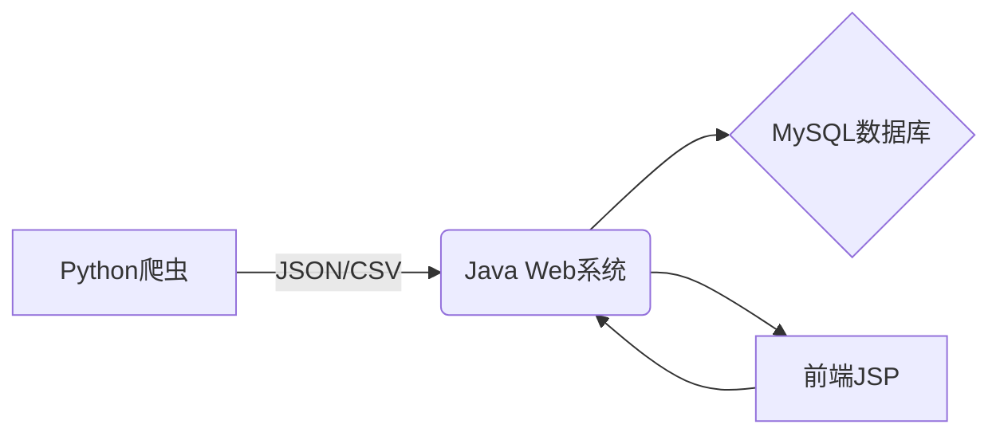

# CanCan 电影信息管理系统 IMDB-TOP250 🎬


## 混合技术栈架构



### 核心组件
- **数据采集层**：Python + BeautifulSoup + Requests
- **业务逻辑层**：Java Servlet + JSP
- **数据存储层**：MySQL 8.0

## 爬虫模块说明

### 功能特性
- 🌐 自动抓取IMDB Top 250电影数据
- 🧹 数据清洗与结构化处理
- 💾 生成多表关联的CSV文件：
  - `movies.csv`
  - `actors.csv` 
  - `directors.csv`
  - `ratings.csv`
  - `genres.csv`

### 使用方式
```bash
# 安装依赖
pip install beautifulsoup4 requests

# 运行爬虫
python 详情请求.py
```

## Java系统集成

### 数据导入流程
1. 运行Python爬虫生成CSV
2. 使用`生成sql初始化语句脚本.py`转换数据
3. 执行生成的SQL文件初始化数据库

